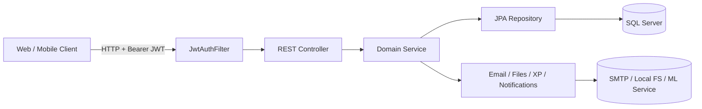

# Covalent GP Backend - Technical Documentation

## 1. Project Overview

This repository contains the backend for the Covalent graduation project platform, a community-driven academic space for university students. The backend provides the server-side APIs that power authentication, user profiles, study spaces, post and answer discussions, learning material sharing, course registrations, gamification, notifications, and ML-assisted recommendations.

The system is designed around a student collaboration workflow:

- users register and authenticate with JWTs,
- join or create spaces for courses or topics,
- ask and answer questions,
- share files or links as materials,
- bookmark useful resources,
- collect XP and streak rewards,
- and receive notifications for activity in the platform.

### Main business problem solved

The backend centralizes academic collaboration and engagement in one platform. It helps students:

- discover relevant spaces for their courses or interests,
- share lecture materials and useful links,
- ask questions and get answers from peers,
- track academic-related activity through gamification,
- and manage their learning history and recommendations.

### Core features

- JWT-based authentication with access and refresh token rotation.
- User profile management and password reset flows.
- Space creation, discovery, membership, admin promotion, and duplicate detection.
- Post/question workflow with answers, solved-state handling, voting, and top-answer retrieval.
- Material sharing through file uploads and external links.
- Bookmarks for materials.
- XP, levels, streaks, and leaderboard generation.
- In-app notifications and email notifications for selected events.
- Course registration history for recommendation support.
- OpenAPI/Swagger documentation.

### Target users

- Students using the platform to collaborate around courses and topics.
- Space admins who manage communities.
- Future maintainers who extend the current business flows.
- Reviewers who need a reliable map of the backend responsibilities.

### High-level backend responsibilities

- Expose REST APIs.
- Enforce authentication and authorization.
- Persist domain state in a relational database.
- Apply validation and business rules.
- Publish consistent API responses and error messages.
- Integrate with email, file storage, and an external ML service.

## 2. Tech Stack

| Area | Technology | Version / Notes |
|---|---|---|
| Language | Java | 21 |
| Framework | Spring Boot | 4.0.3 |
| Web API | Spring MVC | `spring-boot-starter-web` |
| Persistence | Spring Data JPA + Hibernate | JPA entities and repositories |
| Database | Microsoft SQL Server | JDBC driver via `mssql-jdbc` |
| AuthN/AuthZ | Spring Security + JWT | `jjwt-api` 0.12.5, `jjwt-impl` 0.12.5, `jjwt-jackson` 0.12.5 |
| Validation | Spring Validation | Bean Validation annotations |
| Object mapping | ModelMapper | 3.2.0 |
| API docs | springdoc-openapi | 3.0.2 |
| Email | Spring Mail | SMTP-backed transactional emails |
| File upload | Spring Multipart + local filesystem | `FileStorageService` |
| HTTP client | Spring `RestClient` | Configured for the Python ML service |
| Observability | Spring Boot Actuator | Health and metrics endpoints |
| Testing | JUnit 5, Mockito, Spring Boot Test, Spring Security Test | H2 used for tests |
| Coverage | JaCoCo | 0.8.12 |
| Developer productivity | Lombok, DevTools | Lombok reduces boilerplate; DevTools for hot reload |

### What is not present in the repository

- No message queue integration is wired in.
- No cache layer such as Redis is configured.
- No Dockerfile or compose setup is present in the inspected tree.
- No CI/CD pipeline files are present in the inspected tree.
- No cloud provider SDKs are wired directly into the backend.

## 3. Project Structure

```text
src/
├── main/
│   ├── java/com/gp/GP_backend/
│   │   ├── GpBackendApplication.java
│   │   ├── config/
│   │   │   ├── CorsConfig.java
│   │   │   ├── ModelMapperConfig.java
│   │   │   ├── OpenApiConfig.java
│   │   │   ├── SecurityConfig.java
│   │   │   └── WebClientConfig.java
│   │   ├── domain/
│   │   │   ├── user/
│   │   │   │   ├── controller/
│   │   │   │   ├── dto/
│   │   │   │   ├── entity/
│   │   │   │   ├── repository/
│   │   │   │   └── service/
│   │   │   ├── space/
│   │   │   │   ├── controller/
│   │   │   │   ├── dto/
│   │   │   │   ├── entity/
│   │   │   │   ├── repository/
│   │   │   │   └── service/
│   │   │   ├── post/
│   │   │   ├── material/
│   │   │   ├── notification/
│   │   │   └── recommendation/
│   │   ├── security/
│   │   │   ├── JwtAuthFilter.java
│   │   │   ├── JwtTokenProvider.java
│   │   │   └── UserDetailsServiceImpl.java
│   │   └── shared/
│   │       ├── exception/
│   │       ├── response/
│   │       ├── scheduled/
│   │       ├── storage/
│   │       └── util/
│   └── resources/
│       ├── application.properties
│       ├── application-dev.properties
│       ├── application-prod.properties
│       └── database-init.sql
└── test/
    ├── java/com/gp/GP_backend/
    │   ├── GpBackendApplicationTests.java
    │   ├── integration/
    │   ├── domain/
    │   └── shared/
    └── resources/
        ├── application-test.properties
        └── application.properties
```

### Structure explanation

- `config/` contains cross-cutting Spring configuration.
- `security/` contains JWT parsing, the authentication filter, and the bridge to the user repository.
- `domain/` is organized by feature area rather than by technical layer alone.
- `shared/` contains reusable infrastructure such as API wrappers, exceptions, storage, scheduling, and utilities.
- `resources/` holds environment-specific configuration and the reference SQL schema.
- `test/` contains unit tests, integration tests, and the H2 test profile.

## 4. System Architecture

The backend follows a layered Spring architecture:

1. The client sends an HTTP request.
2. Spring Security runs the JWT filter and populates the security context if the token is valid.
3. The controller receives the request and validates the DTO.
4. The service layer applies business rules and coordinates multiple repositories or support services.
5. Repositories persist or read data from SQL Server.
6. Shared infrastructure handles errors, response envelopes, email, uploads, scheduled cleanup, and token parsing.



### Architecture characteristics

- Stateless authentication: no HTTP sessions are used.
- Rich domain services: rules live in services, not controllers.
- Consistent response envelope: every API response uses `ApiResponse`.
- Transactional writes: the important service methods are wrapped in `@Transactional`.
- Hybrid persistence modeling: some associations are real JPA relationships, while some cross-domain links are stored as raw UUID columns to reduce coupling.

## 5. Domain Modules

### 5.1 User and Authentication

This module handles account lifecycle, login, profile updates, password management, course registrations, and gamification-facing user state.

Main responsibilities:

- registration,
- login and token issuance,
- refresh token rotation,
- logout,
- password reset,
- profile read/update,
- course registration CRUD,
- gamification profile and leaderboard readouts.

#### Main controllers

- `/api/v1/auth`
- `/api/v1/users`
- `/api/v1/courses`
- `/api/v1/gamification`

#### Important services

- `UserService`: registration and profile management.
- `RefreshTokenService`: refresh token creation, rotation, revocation.
- `PasswordResetService`: forgot-password and change-password flows.
- `CourseRegistrationService`: course history management.
- `GamificationService`: XP and leaderboard logic.

### 5.2 Spaces

Spaces are the core community container in the platform.

Main responsibilities:

- create spaces,
- detect duplicates or near-duplicates,
- manage membership,
- search and list spaces,
- enforce admin privileges,
- preserve member counts.

#### Main controller

- `/api/v1/spaces`

### 5.3 Posts and Answers

This module powers question posting, discussion posts, answers, accepted answers, voting, feed retrieval, and search.

Main responsibilities:

- create posts,
- create answers,
- edit/delete owned content,
- mark questions solved,
- unmark solved status,
- load answers with pagination and ranking,
- search posts,
- track views and counters,
- award or revoke XP,
- trigger notifications.

#### Main controller

- `/api/v1/spaces/{spaceId}/posts`
- `/api/v1/posts`

#### Voting service

- `VoteService` handles question-level votes and answer upvotes.

### 5.4 Materials

This module manages shared learning materials, both uploaded files and external links.

Main responsibilities:

- file uploads,
- link sharing,
- file downloads,
- bookmarking and unbookmarking,
- per-space listing and search,
- material editing and deletion,
- link-count tracking,
- XP awards for sharing and bookmarking.

#### Main controller

- `/api/v1/materials`

### 5.5 Notifications

This module stores and exposes in-app notifications and user notification preferences.

Main responsibilities:

- create notifications for post, answer, vote, material, and acceptance events,
- list notifications with pagination,
- mark notifications as read,
- toggle in-app and email preferences.

#### Main controller

- `/api/v1/notifications`

### 5.6 Recommendations

This module now has one implemented production flow and two planned ML-backed flows.

Current state:

- personalized space recommendations are implemented in `SpaceRecommendationService`,
- the active endpoint returns ranked spaces using course match, social graph, and text similarity signals,
- the course and department ML services are scaffolded and still depend on the external Python service,
- the `RestClient` bean is configured for future ML calls.

#### Main controller

- `/api/v1/recommendations/spaces`
- `/api/v1/recommendations`

## 6. API Surface

### Authentication and account endpoints

| Method | Path | Purpose |
|---|---|---|
| POST | `/api/v1/auth/register` | Register a new account |
| POST | `/api/v1/auth/login` | Authenticate and return access + refresh tokens |
| POST | `/api/v1/auth/refresh` | Rotate refresh token and issue a new access token |
| POST | `/api/v1/auth/logout-all` | Revoke all refresh tokens for the current user |
| POST | `/api/v1/auth/forgot-password` | Send password reset email |
| POST | `/api/v1/auth/reset-password` | Redeem reset token and set a new password |
| GET | `/api/v1/users/profile` | Read current user profile |
| PATCH | `/api/v1/users/profile` | Update current user profile |
| POST | `/api/v1/users/change-password` | Change current user password |
| POST | `/api/v1/users/logout` | Revoke a specific refresh token |

### Course registration endpoints

| Method | Path | Purpose |
|---|---|---|
| POST | `/api/v1/courses` | Register a course for the authenticated user |
| PATCH | `/api/v1/courses/{id}` | Update a registration |
| DELETE | `/api/v1/courses/{id}` | Remove a registration |
| GET | `/api/v1/courses/{id}` | Read one registration |
| GET | `/api/v1/courses/current` | List active registrations |
| GET | `/api/v1/courses/all` | List all registrations |

### Gamification endpoints

| Method | Path | Purpose |
|---|---|---|
| GET | `/api/v1/gamification/me` | Read current user gamification profile |
| GET | `/api/v1/gamification/leaderboard` | Read system leaderboard |
| GET | `/api/v1/gamification/leaderboard/spaces/{spaceId}` | Read leaderboard for one space |

### Space endpoints

| Method | Path | Purpose |
|---|---|---|
| POST | `/api/v1/spaces` | Create a space |
| GET | `/api/v1/spaces/{spaceId}` | Read a space the user belongs to |
| GET | `/api/v1/spaces/all-spaces` | List all spaces for the current user |
| GET | `/api/v1/spaces/active-spaces` | List active spaces with pagination |
| GET | `/api/v1/spaces/search` | Search active spaces |
| POST | `/api/v1/spaces/{spaceId}/join` | Join a space |
| DELETE | `/api/v1/spaces/{spaceId}/leave` | Leave a space |
| PATCH | `/api/v1/spaces/{spaceId}` | Update a space |
| POST | `/api/v1/spaces/{spaceId}/admins/{memberId}` | Promote a member to admin |

### Post and answer endpoints

The post module exposes create/read/update/delete flows for questions and answers plus business actions such as acceptance and voting. The exact controller is split across post-specific and vote-specific operations.

Main capabilities:

- create a post in a space,
- edit and delete owned posts,
- create and edit answers,
- mark and unmark accepted answers,
- retrieve a post,
- retrieve answers with pagination,
- list all posts in a space,
- search posts,
- vote on questions and answers.

### Material endpoints

| Method | Path | Purpose |
|---|---|---|
| POST | `/api/v1/materials/upload` | Upload a file material |
| POST | `/api/v1/materials/link` | Share an external link |
| GET | `/api/v1/materials/{materialId}/download` | Download a file material |
| POST | `/api/v1/materials/{materialId}/bookmark` | Bookmark a material |
| DELETE | `/api/v1/materials/{materialId}/bookmark` | Remove a bookmark |
| PATCH | `/api/v1/materials/{materialId}` | Edit a material |
| DELETE | `/api/v1/materials/{materialId}` | Delete a material |
| GET | `/api/v1/materials/{materialId}` | Read a material |
| GET | `/api/v1/materials/space/{spaceId}/materials` | List materials for a space |
| GET | `/api/v1/materials/space/{spaceId}/paged` | Paginated space materials |
| GET | `/api/v1/materials/space/{spaceId}/bookmarked` | List bookmarked materials |
| GET | `/api/v1/materials/space/{spaceId}/search` | Search materials in a space |

### Notification endpoints

| Method | Path | Purpose |
|---|---|---|
| GET | `/api/v1/notifications/all-notifications` | List notifications |
| PUT | `/api/v1/notifications/mark-read/{notificationId}` | Mark one notification read |
| PUT | `/api/v1/notifications/toggle-email` | Toggle email notifications |
| PUT | `/api/v1/notifications/toggle-inapp` | Toggle in-app notifications |

### Recommendation endpoints

| Method | Path | Purpose |
|---|---|---|
| GET | `/api/v1/recommendations/spaces` | Return personalized space recommendations |
| Planned | `/api/v1/recommendations/courses` | Personalized course suggestions |
| Planned | `/api/v1/recommendations/department` | Department prediction |

## 7. Business Logic and Request Flow

### Authentication flow

1. A user submits email and password to `/api/v1/auth/login`.
2. Spring Security uses `AuthenticationManager` and `UserDetailsServiceImpl` to validate credentials.
3. `JwtTokenProvider` generates a short-lived access token and `RefreshTokenService` issues a refresh token.
4. The authenticated user is returned in the response payload.
5. `GamificationService.trackDailyLogin()` is called after login to update streaks and daily XP.

### Token rotation and session security

Refresh tokens are rotated, not reused.

- login revokes any old refresh tokens for that user,
- refresh exchanges the current token for a new token in the same family,
- reuse of a revoked token triggers family-wide revocation,
- logout can revoke one refresh token or all tokens for the user.

This is a strong defense against refresh token replay and token theft.

### Password reset flow

1. A user requests a reset from `/api/v1/auth/forgot-password`.
2. The backend generates a secure raw token and stores only its SHA-256 hash.
3. An email is sent with a frontend reset link containing the raw token.
4. The reset endpoint validates the token, updates the password, marks the reset token used, and revokes all refresh tokens.

### Space lifecycle

- Space names must be unique.
- Slugs are generated from the name and made unique with suffixes if needed.
- Duplicate detection uses two strategies:
  - direct course-code matching for `COLLEGE_COURSE`,
  - Jaccard text similarity for other categories.
- The creator becomes the first `ADMIN` member automatically.
- Joining increments member count.
- Leaving decrements member count, but the sole admin cannot leave until another admin exists.
- Admin promotion is explicit and only allowed for existing members.

### Recommendation lifecycle

- Space recommendations blend three independent signals:
  - course-code overlap with the user's current registrations,
  - friends-of-friends space overlap from existing memberships,
  - Jaccard text similarity against spaces the user already belongs to.
- Recommendations are ranked first by how many signals selected the space, then by combined score.
- Each recommendation includes the recommended `Space`, a `methodCount`, a numeric `score`, and a set of `reasons`.
- Course and department recommendation services are still placeholders for the external Python ML service.

### Post and answer lifecycle

- Posting requires membership in the target space.
- A post may be a question or a discussion.
- Answers require membership in the post's space.
- Views are incremented when a post is read.
- A post can be marked solved by its author only.
- Accepted answers are stored on both the post and the answer for consistency.
- Deleting a post removes votes and answers associated with it.
- Editing and deleting answers are restricted to the answer author.

### Voting lifecycle

- A user must be a member of the space.
- A user cannot vote on their own post or answer.
- Duplicate votes are blocked by service checks and a unique constraint.
- Question votes increase `goodQuestionCount` and award XP to the post author.
- Answer votes increase `upvoteCount` and award XP to the answer author.
- Removing a vote reverses the counter and the XP award.

### Material lifecycle

- Only space members can upload or view materials.
- Uploads are validated by type and size and then stored in the local upload directory.
- File materials keep a stored filename; link materials keep the external URL.
- Bookmarking increments material link count.
- Bookmarking by another user awards XP to the material owner.
- Unbookmarking revokes that XP and decrements the link count.
- Only the uploader can edit or delete a material.

### Gamification lifecycle

XP is awarded for platform participation.

| Event | XP | Notes |
|---|---:|---|
| Post created | 10 | Author receives XP |
| Answer given | 15 | Answer author receives XP |
| Answer upvoted | 5 | Answer author receives XP |
| Good question vote | 3 | Post author receives XP |
| Answer accepted | 20 | Answer author receives XP |
| Material shared | 10 | Material owner receives XP |
| Material bookmarked by another user | 3 | Material owner receives XP |
| Daily login | 2 | Once per day |
| Streak bonus | 15 | Awarded at 7, 15, 30, and 100 day milestones |

Level progression uses a quadratic curve:

```text
level = floor(1 + sqrt(xp / 100))
```

This means levels become progressively harder to reach as XP increases.

## 8. Database Design

The project uses SQL Server in development and production-oriented schemas. Most entities use UUID primary keys; two token tables intentionally use numeric identity keys because they are internal-only tables.

### Main tables

| Table | Purpose | Key relationships |
|---|---|---|
| `users` | Core user account data | Referenced by almost every other table |
| `refresh_tokens` | JWT refresh token store | Many-to-one to `users` |
| `password_reset_tokens` | One-time password reset tokens | Many-to-one to `users` |
| `gamification_profiles` | XP, level, streaks, counters | One-to-one with `users` |
| `xp_transactions` | Append-only XP audit log | Many-to-one to `users` |
| `courses_registered` | User course history | Many-to-one to `users` |
| `spaces` | Community containers | Many-to-one to `users` through creator |
| `space_memberships` | User membership and role in a space | Many-to-one to `users` and `spaces` |
| `posts` | Questions and discussions | References `spaces` and `users` by UUID columns |
| `answers` | Answers to posts | References `posts` and `users` by UUID columns |
| `votes` | Good-question votes and answer upvotes | References `users`; target is polymorphic |
| `materials` | Shared files and links | Many-to-one to `spaces` and `users` |
| `material_links` | Bookmark table | Many-to-one to `materials` and `users` |
| `notifications` | In-app notification records | Many-to-one to `users` |
| `notification_preferences` | In-app / email preference flags | Many-to-one to `users` |

### Important design choices

- `posts`, `answers`, `votes`, and `xp_transactions` use polymorphic or UUID-based references rather than complex JPA associations in some places.
- `votes` and `material_links` have uniqueness constraints to prevent duplicate actions.
- `spaces` and `materials` use denormalized counters such as `memberCount` and `linkCount` for fast reads.
- `gamification_profiles` stores aggregate counters alongside XP and streak values for fast leaderboard queries.
- `xp_transactions` acts as an audit log and idempotency guard.
- `refresh_tokens` support family-based rotation and reuse detection.

### Dev schema versus reference schema

The `database-init.sql` file documents the core SQL Server schema. In development, Hibernate is configured with `ddl-auto=update`, so additional entities such as `notification_preferences` can still be generated from JPA mappings even if they are not explicitly listed in the reference script.

## 9. Security Model

### Authentication

- JWT access tokens are signed with a Base64 HMAC secret.
- The access token contains the user email as the subject and the user UUID as an extra claim.
- A custom `OncePerRequestFilter` extracts `Authorization: Bearer <token>` and populates the Spring Security context.

### Authorization

- The API is stateless and requires JWTs on protected endpoints.
- Public endpoints are limited to registration, login, token refresh, forgot-password, reset-password, and documentation routes.
- Many operations also enforce domain-level authorization:
  - space membership checks,
  - uploader ownership checks,
  - author-only checks,
  - admin-only checks.

### Password handling

- Passwords are encoded with BCrypt.
- Reset tokens are stored only as SHA-256 hashes.
- Password change and password reset both revoke active refresh tokens.

### Defensive design

- Controllers use validation annotations to reject malformed requests early.
- The global exception handler hides low-level details from the client.
- File uploads are size-limited and MIME-type restricted.
- Local file access is normalized to reduce path traversal risk.
- Email delivery is best-effort and does not block the request.

## 10. Configuration and Runtime Environment

### Profiles

- `application.properties` activates the `dev` profile by default.
- `application-dev.properties` contains the local SQL Server, SMTP, file storage, and ML-service settings.
- `application-prod.properties` is minimal and intentionally stricter for schema handling.
- `application-test.properties` uses H2 in MSSQL compatibility mode.

### Local development settings

- Server port: `8080`
- SQL Server database: `GP_db`
- Upload directory: `uploads`
- Frontend base URL: `http://localhost:5173`
- ML service base URL: `http://localhost:5001`

### External integration points

- SMTP for email delivery.
- Local filesystem for material uploads.
- Python ML recommendation service through `RestClient`.

## 11. Error Handling and API Envelope

All controllers return a shared response wrapper:

```json
{
  "success": true,
  "message": "Login successful",
  "data": {},
  "timestamp": "2026-05-21T00:00:00Z"
}
```

### Response wrappers

- `ApiResponse<T>` is the standard envelope for success and failure responses.
- `PagedResponse<T>` wraps Spring `Page` into a client-friendly structure.

### Global exception mapping

The backend converts validation and business exceptions into controlled HTTP responses.

| Exception type | Typical HTTP status | Behavior |
|---|---|---|
| `MethodArgumentNotValidException` | 400 | Aggregates field errors |
| `ConstraintViolationException` | 400 | Aggregates query parameter violations |
| `ApiException` | Custom | Uses status stored in the exception |
| `BadCredentialsException` | 401 | Returns a generic login error |
| `AuthorizationDeniedException` | 403 | Returns a generic forbidden message |
| `ResponseStatusException` | As provided | Preserves status and reason |
| `DataIntegrityViolationException` | 409 | Returns a generic conflict message |
| Unhandled `Exception` | 500 | Returns a generic server error |

## 12. Testing Strategy

The repository has a healthy mix of smoke, integration, and service-level tests.

### Test stack

- JUnit 5 for test execution.
- Mockito for isolated service tests.
- Spring Boot Test for integration context loading.
- Spring Security Test for auth-related testing.
- H2 for a self-contained test database.
- JaCoCo for coverage reports.

### Test categories observed

- Application context smoke test.
- Integration test for the full space-post-answer-material flow.
- Unit tests for post voting, material management, space behavior, password reset, refresh tokens, gamification, and validation.

### Test profile behavior

- The test profile uses H2 in-memory storage.
- SQL initialization is disabled in tests.
- Mail is pointed at localhost so tests do not depend on a real SMTP provider.

## 13. Development Workflow

### Recommended local flow

1. Start SQL Server and ensure the `GP_db` database exists.
2. Run the backend with the dev profile.
3. Open Swagger UI at `http://localhost:8080/swagger-ui/index.html`.
4. Use the login endpoint to obtain a JWT.
5. Paste the JWT into Swagger's Authorize dialog.
6. Exercise protected endpoints with the token in place.

### Build and run

The repository documentation indicates the following workflow:

- package the application with Maven,
- then run the Spring Boot app normally.

The README notes the expected local startup sequence and the Swagger URL.

### Extending the codebase safely

- Keep business rules in services, not controllers.
- Add DTOs for every request and response shape.
- Register new mappings in `ModelMapperConfig` only when necessary.
- Put cross-cutting behavior in `shared/` or `config/`.
- Use `ApiException` for domain rule violations.
- Preserve idempotency in award/revoke style operations.

## 14. Current Implementation Notes and Gaps

The repository is functional, but a few areas are still incomplete or need attention from maintainers:

- Space recommendations are implemented, but the ML-backed course and department recommendation services are still scaffolded.
- The notification controller currently mirrors the base path in each method mapping, which likely produces duplicated route prefixes.
- Some notification flows are implemented in service code, but controller route naming should be reviewed before production exposure.
- Production configuration is intentionally minimal and still needs environment-variable based secret management.
- There is no repository-managed containerization or CI/CD pipeline in the inspected project tree.

## 15. Practical Summary for New Developers

If you are new to the project, the important mental model is this:

- `User` is the identity root.
- `Space` is the collaboration boundary.
- `Post` and `Answer` drive discussion.
- `Material` drives resource sharing.
- `GamificationService` turns every meaningful action into XP and leaderboard state.
- `NotificationService` mirrors important activity back to users.
- `RefreshTokenService` and `PasswordResetService` keep the security model safe and stateful where needed.

In short, the backend is a Spring Boot monolith organized by domain. It is built to support a collaborative academic community with a strong authentication layer, rich activity tracking, and clear extension points for recommendation and notification features.